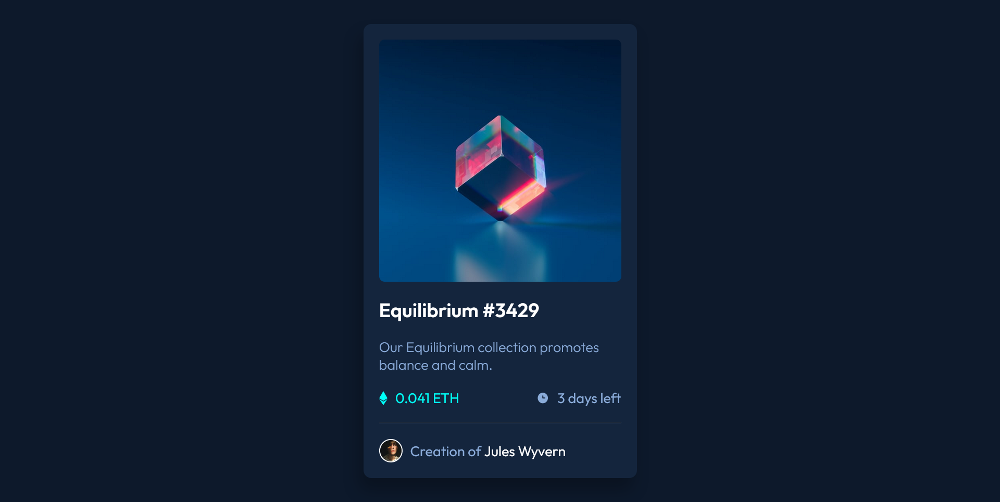
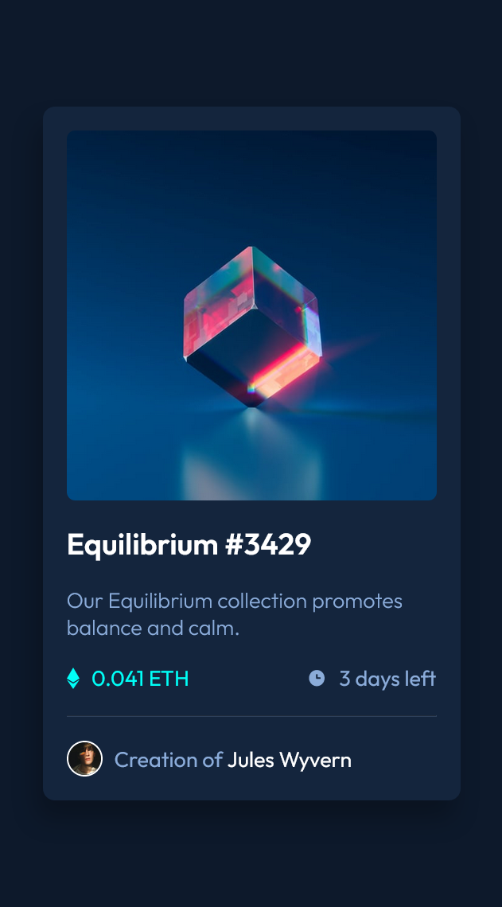

# Frontend Mentor - NFT preview card component solution

This is a solution to the [NFT preview card component challenge on Frontend Mentor](https://www.frontendmentor.io/challenges/nft-preview-card-component-SbdUL_w0U). Frontend Mentor challenges help you improve your coding skills by building realistic projects. 

## Table of contents

- [Overview](#overview)
  - [The challenge](#the-challenge)
  - [Screenshot](#screenshot)
  - [Links](#links)
  - [What I learned](#what-i-learned)
- [Author](#author)

## Overview

### The challenge

Users should be able to:

- View the optimal layout depending on their device's screen size
- See hover states for interactive elements

### Screenshot

### Links

- Solution URL: [Add solution URL here](https://your-solution-url.com)
- Live Site URL: [Add live site URL here](https://your-live-site-url.com)

### What I learned

Welcome back, Kwan
Welp, it's been over 4 months since I stopped doing Frontend Mentor's challenges, and now I'm back. I still got the gist of the order and the thinking process when it comes to card design. That's quite a good start over.

## Author

- Frontend Mentor - [@69kwan69](https://www.frontendmentor.io/profile/69kwan69)
- Twitter - [@TrvanQuan69](https://www.twitter.com/TrvanQuan69)
